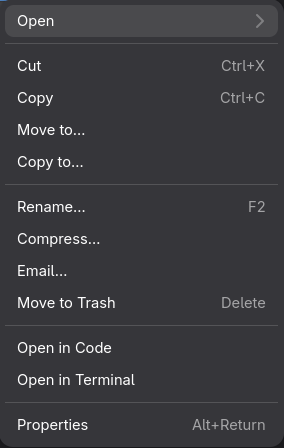
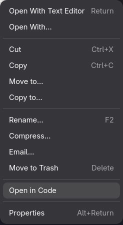

# Setting up Nautilus File Manager

Ensure installed:
- **`nautilus`**
- `python`
- `python-nautilus`
- `alacritty`
- `visual-studio-code-bin`<sup>AUR</sup>

## Setup

Symlink this folder with `~/.config/nautilus`.

```bash
sudo ln -s -n '/home/kalpakavindu/Source/dotfiles/linux/nautilus' '/home/kalpakavindu/.local/share/nautilus-python'

# Give execute permission to the script
chmod +x '/home/kalpakavindu/.local/share/nautilus-python/scripts/Open in Code'

# Restart nautilus
nautilus -q
```
## Preview

Context menu for Directories



Context menu for Files

