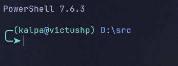

# Setting up PowerShell 7

Ensure installed:
- **`PowerShell 7`**

## Setup
Create a symlink for `.\profile.ps1` to `~\OneDrive\Documents\PowerShell\Microsoft.PowerShell_profile.ps1`. Run the following command in Windows Powershell with  Administrator privileges.

```powershell
New-Item -Type SymbolicLink `
-Target "D:\dotfiles\windows\powershell\profile.ps1" `
-Path "C:\Users\kalpa\OneDrive\Documents\PowerShell\Microsoft.PowerShell_profile.ps1"
```

## Preview

Powershell prompt for normal users



Powershell prompt with Admin privileges

